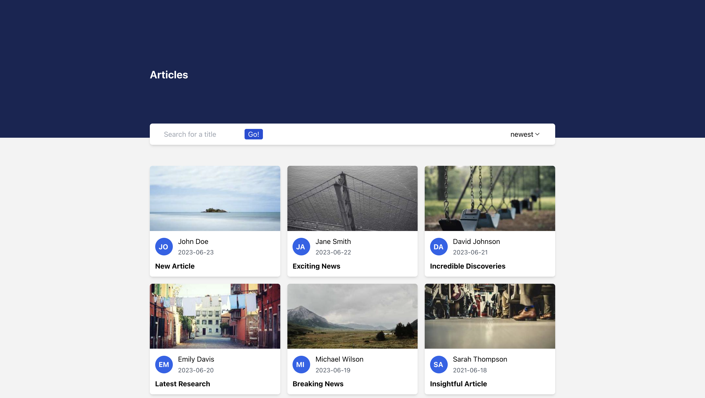
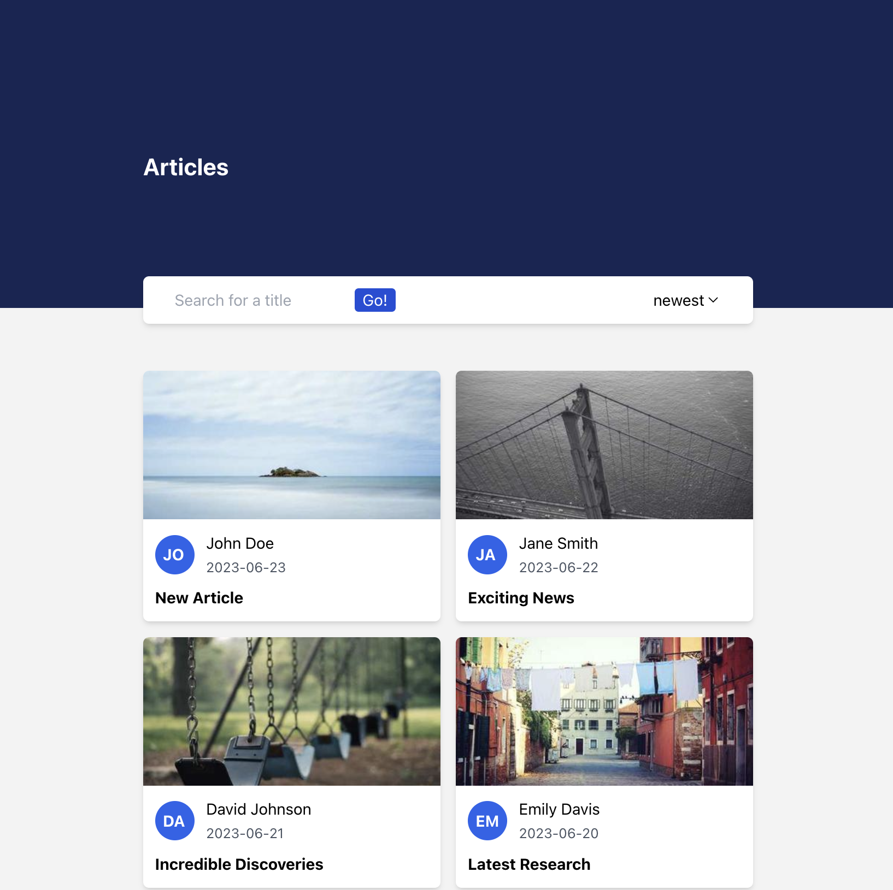

# React Aufgabe

## List-Search

## Aufgabenstellung

Bei dieser Aufgabe geht es um die Umsetzung eines responsiven Karten-Layouts, wobei die Karten gefiltert und sortiert werden können.

Die Daten für die Karten können über src/api/index.ts bezogen werden.

Setze bitte das Design, sowie die beschriebenen Funktionalitäten um.

### Teil 1 - Design umsetzen

Im Verzeichnis `mockups` findest Du die umzusetzenden Layouts:

Die Liste von Karten soll responsiv umgesetzt werden, wobei die maximale Breite des Content-Bereichs 920px und die minimale 320px betragen soll.

Das Gesamtlayout besteht aus einem Header mit Überschrift, einer Funktionsleiste und einer Liste mit Karten.

Die Funktionsleiste beinhaltet ein Suchfeld mit einem Button und ein Filter-Dropdown.

Die einzelnen Karten sind folgendermaßen aufgebaut:

- Titelbild
- Autoren-Avatar (blauer Kreis mit den ersten zwei Buchstaben von dem Namen)
- Name des Autors
- Erstellungsdatum des Artikels
- Titel des Beitrags

**Hinweise:**

### Teil 2 - Funktionalität umsetzen

Bitte setze die nachfolgend beschriebenen Funktionen um.

**App Funktionen**

Über die Suchfunktion soll man nach den Titeln suchen können. Dabei sollen nur die gefilterten Karten angezeigt werden.

Die Beiträge sollen weiterhin über ein Dropdown nach Datum (auf- und absteigend) sortiert werden können.
